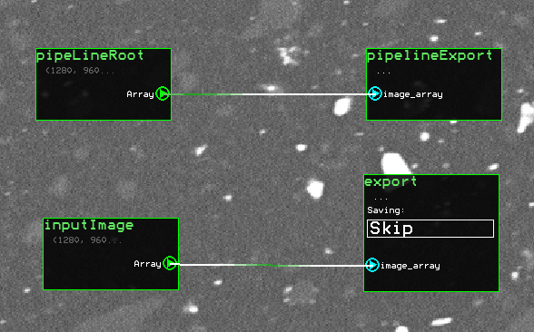
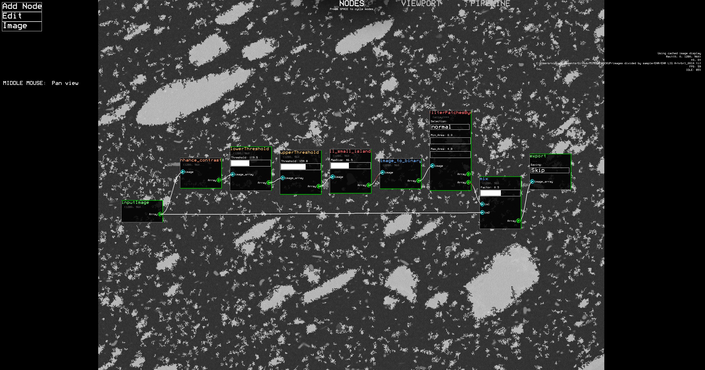

# MIMOSA — Microscopy Image Processing Software

## Overview

MIMOSA is a modular, node‑based image analysis system optimized for high‑resolution SEM (Scanning Electron Microscope) images. Its primary objective is fast and reproducible particle segmentation, feature extraction, and quantitative analysis. The system integrates TensorFlow, NumPy, SciPy, OpenCV, scikit‑image, Numba, and Pygame into a unified workflow that allows interactive inspection, high‑throughput processing, and customizable pipelines.

MIMOSA targets research environments where particle morphology, size distributions, and microstructural statistics must be extracted from large grayscale micrographs (e.g., polymer composites and fillers).

---

## Core Concepts

### Node‑Based Processing

All operations are implemented as modular processing nodes. A node receives an image, applies a transformation, and outputs a transformed image. Nodes expose:

* A callable processing function.
* A metadata signature describing required inputs and produced outputs.
* Parameters that can be edited through the GUI.

Typical node types:

* Filtering (Gaussian, median, contrast, sharpening)
* Thresholding (tolerance, fixed)
* Segmentation (connected components, morphological operations, filling)
* Mathematical operations (normalization, subtraction, ratio ops)

Nodes can be arranged into processing graphs defining complete analysis pipelines.

---

## Performance Architecture

### High‑Resolution Image Handling

MIMOSA is designed for images up to **5120×4800** pixels and above. To maintain interactivity:

* Compute‑heavy functions are compiled with **Numba** where beneficial.
* Pipeline nodes minimize data copies and operate in‑place when safe.
* Large intermediate arrays are reused through a shared workspace.

### Parallelism and Execution

* The pipeline executes synchronously to guarantee deterministic results.
* Certain nodes internally use multi‑threaded Numba/NumPy/SciPy operations.
* Progress and timing statistics are visualized using Pygame during execution.

### Real‑Time Display

The GUI uses **Pygame** for:

* All graphical elements, such as buttons and nodes.
* Interactive image panning

---

# Workflow walkthrough

## Segmentation Workflow

A typical segmentation workflow consists of:

1. Pre‑filtering (noise suppression)
2. Thresholding to produce a binary mask
3. Morphological cleanup
4. Optional post‑filtering based on size, solidity, circularity, or eccentrity

Steps 1-3 are handled by the **KERAS_Model** node. All steps are customizable and modular.

## The node structure

The nodes execture from left to right. The node structure must form a closed connected cue of nodes. This means that a node with only leftside inputs must connect consecutively to a node with only rightside outputs. This essentially means that the node structure must feature one of the sets of IO nodes featured in the below image. 'inputImage' and 'export' are legacy nodes, with the additional feature of the render window, which can be drawn in the Viewport tab to mark a smaller rectangle for processing, eliminating calculation time. 'pipelineRoot' and 'pipelineExport' have the feature of being able to process pipeline images. Use the former for single image processing and the latter for pipeline analysis/large scale analysis.




Connect additional nodes in between the two nodes you have selected. Following the segmentation workflow, first pre-filter if necessary. Add contrast enhancement, sharpening or noise suppression if you have a low quality image. Add a 'lowerThreshold' node to filter out the non-desired matrix, fill the inner thresholded black islands of the particle with the 'fill_small_islands', and separate noise with 'filterPatchesByArea'. 'filterPatchesByArea' has two sliders which define the pixel range of the particles that are selected, and the two outputs represent the particles that fall inside the range, and outside the range. Use the second output to filter out noise. If desired, filter the particles with the 'particleFiltration' node with the provided options. These can help with excluding cracks and other defects that have been misdetected. Finally, ensure the image has been converted to binary at some point, desirably right after thresholding to ensure that the particle labeling is conducted correctly. A basic example for particle segmentation is shown below.



Optionally, use 'KERAS_Model' to handle the workflow automatically. If particles are connected and intertwined, you can try to separate them with 'KERAS_SegmentParticles', which runs a convolutional neural network to separate particles where evident. Since the resulting image of both 'KERAS_Model' and 'KERAS_SegmentParticles' are nonbinary (pixels have luminosity range), use 'lowerThreshold' and 'image_to_binary' afterwards to select a pixel range and convert the image to binary. 

## The pipeline tool

To use the standard pipeline setup, in the node tab, select Edit/Setup/Load, and select the presets/PIPELINE_STD.pkl. This network uses the KERAS_Model node to extract the particles and is usable for ~90% of acceptable quality images. Ensure you have the neural networks downloaded. Select the pipeline tab, which automates the workflow for large image batches. Add a sample with the button and rename it. Each sample forms it's own dispersion data from the images that are listed below it. Load an image batch. If images do not load, see console for output, check the data/config.yaml and post an issue to the GitHub. More info at section **Setting up the metadata for images**. Drag and drop the images from **Unsorted** to the sample you have created. When images are under the correct samples, press **Run AI**. This button runs the currently loaded node network in the **Node** tab on every image, so ensure you have 'pipelineRoot' and 'pipelineExport' as the endpoints of the structure (the preset PIPELINE_STD.pkl already has them). After the images have processed, and each image is colored YELLOW, press **Inspect results**. This step is required to visually inspect if the particle maps are accurate enough. Press **Toggle** to switch between the raw image and the particle map. If the particle map is not satisfactory, select **Don't use**, otherwise **Use**. When the images have been inspected, each image should be either green or red indicating wether the image will be used in the analysis. Select **Calculate Dispersion**. The operation should be fast, and if the progress bar freezes, check console for errors and post an issue if an error has occured. When the progress bar finishes, right click a sample and select **View dispersion data**. A bar graph of the particles detected based on diameter is shown, as well as statistical information of the particles. Toggling **Toggle Area** will switch the graph to display the area taken up by the particles on the same graph. Clicking a value will result in automatic copying to clipboard of the value. A CSV file can be exported of the samples, and an excel file is automatically updated in **data/compiled_dispersion_data.xlsx**. 


## Metadata System

Each image carries a metadata dictionary tracking:

* Field of view parameters (from embedded TIFF metadata or external text files)
* Image size (IF image is cropped before or after processing, using the image dimensions will distort the real-world pixel size. Extract image size from metadata if possible.)
* Magnification (Unnecessary. Provides additional information.)
* Stage position (Draws a map of the images if extracted, unnecessary.)

Only field of view is mandatory to extract. Metadata survives across node transitions and persists into saved project files.

## Setting up the metadata for images

To get the real-world dimensions of the particles, the metadata must be extracted alongside the images. The metadata extraction keys are located in **data/config.yaml**. There are two options available: **textfile** and **metadata**. The **textfile** option is set up for **JEOL IT-500**, where the metadata is output as a .txt file alongside the image, and **metadata** option is set up for **ZEISS ULTRAplus** where the metadata is embedded in the image. By default, the **metadata** option is toggled on, and the configuration is set up for **ZEISS ULTRAplus**.
1. Select the correct option. If the image is not accompanied with a text file, set **mode** to **metadata**, otherwise set **textfile**. 
2. Select field of view keys. A visual tool to inspect the keys of an image is located in **utils/metadataTool.py**. Load an image, and search for values such as FOV, fieldofview, ap_width, ap_height or such. If the field of view values are located in a single key (e.g. [100um, 80um], set the key to FOV_KEY. If the values are separate, set the keys FOV_KEY_X and FOV_KEY_Y).
3. Extract the keys for magnification, stage position and image resolution if necessary. 

*Note: Since the metadata can appear in many forms, it is not guaranteed that the data will load correctly for specific microscopes. Minimal changes to the code might be necessary.

---

## File Input and Output

### Supported Input Formats

* TIFF (metadata extraction)
* PNG
* JPEG
* Raw 8‑bit grayscale
* External metadata text files via user‑configurable key mapping

### Export Functionality

* Processed images
* Binary masks
* Labeled component maps
* Particle statistics
* Full pipeline configuration

---

## Extending MIMOSA

### Adding New Processing Nodes

A new node requires:

* A Python function with signature `def func(image: np.ndarray) -> np.ndarray`
* A doctext with the correct syntax.
* Correct amount of outputs.

Example:
```bash
def cropY(image: np.ndarray, Node: "Node", App: "App") -> np.ndarray:     
    # Node and App can be input into the node without creating additional graphical inputs. These can access all the information of the runtime.
    """
    SLIDER:0:100:50:Test_Slider                 # Utility type (Slider), min value, max value, init value, name
    DROPDOWN:Test_dropdown:Opt1:Opt2:Opt3       # Utility type (dropdown), name, options
    MENUTYPE:Essential                          # Node category (Math, Thresholding, Contrast, Algorithm, AI, Filters, Essential, Data, Misc)
    HELP:Crops the Y axis from the bottom.      # Node tooltip when highlighted
    """
    factor = Node.utility[0].value              # Extract the value of the first utility (enumerated by the order they are listed in the doctext)
    Y = int(image.shape[1] * factor)
    return image[:, :Y, :]                      # Return a numpy array.

```

All nodes are listed in core/nodefuncs.py. Nodes are automatically registered and exposed to the GUI. *Note: Importing a function from a package or another script will result in the generation of a node with that function. This can be used to import custom functions from a separate file.


## Known Limitations

* Numba compilation warm‑up introduces a one‑time cost per node. This crashed one time on a Linux workstation.
* GPU acceleration for TensorFlow is not feasible on Windows.
* Some SciPy morphological operations scale super‑linearly with particle count.
* The AI models are not perfect, and can result in poor particle maps with low quality images.
* Multipage TIFFs might pose problems.

---

## Roadmap

Future planned improvements:

* Image retouching in pipeline to fix obvious errors before computing the dispersion.
* Additional/custom workflows in the pipeline that to calculate values other than dispersion.
* Options for particle diameter measurement (Currently using convex hull max diameter).
* GPU‑accelerated segmentation kernels (Only feasible with Linux workstations)

---

## Summary

MIMOSA provides a high‑performance, modular, and extensible platform for particle segmentation in high‑resolution SEM images. Its combination of node‑based architecture, optimized numeric routines, and interactive visualization enables rapid experimentation, reproducible pipelines, and accurate microstructural analysis.
